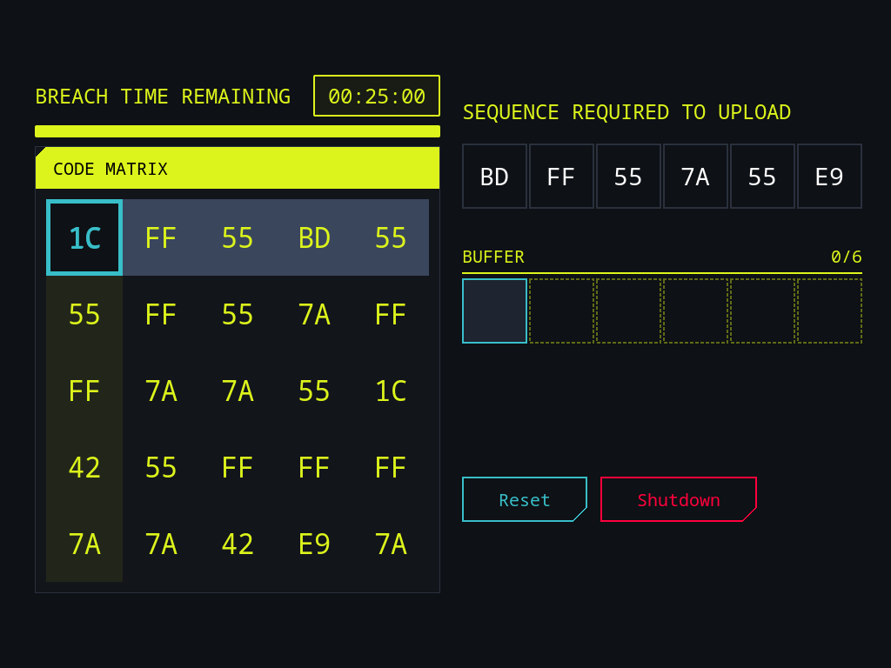

# Breach Protocol (Cyberpunk 2077 Minigame)



A fully playable Python/GTK3 recreation of the **Breach Protocol** hacking minigame from *Cyberpunk 2077*. This application was designed specifically for the Raspberry Pi environment but works on any system supporting PyGObject (GTK3).

## Features

- **Authentic Ruleset**: Accurately recreates the row/column alternating selection logic from the original game.
- **Cyberpunk Aesthetic**: Fully customized CSS styling mimicking the in-game UI, including neon yellow/cyan glowing effects, dark background panels, and micro-animations.
- **Dynamic Board Sizing**: The matrix grid, buffer size, and target sequences are randomly generated on each run, scaling the difficulty organically.
- **Timer Mechanics**: A visual shrinking progress bar tied to the hacking time limit.
- **Keyboard & Mouse Support**: Playable using standard point-and-click or by navigating via keyboard arrow keys and Enter.
- **Immersive Feedback**: Glowing borders, active row/column highlighting, and status messages that instantly tell you if the upload succeeded or failed.

## Requirements

- **Python 3.x**
- **GTK 3.0** (`python3-gi` and `gir1.2-gtk-3.0`)

On Debian/Ubuntu or Raspberry Pi OS, you can install the dependencies via:

```bash
sudo apt-get update
sudo apt-get install python3-gi gir1.2-gtk-3.0
```

## Installation & Usage

Since the script sets up a fullscreen GTK window, it requires an active X11/Wayland display to run.

1. Clone this repository:
   ```bash
   git clone https://github.com/zedward856-spec/pi_breach.git
   cd pi_breach
   ```

2. Run the application:
   ```bash
   python3 breach-protocol.py
   ```

*(Pro-tip: If you want to be able to run it from anywhere, create a symlink to your local bin directory: `ln -s ~/pi_breach/breach-protocol.py ~/.local/bin/breach-protocol.py`)*

## How to Play

1. **The Objective**: Select hex codes from the **Code Matrix** to match the required **Target Sequence**. 
2. **The Catch**: Your first selection must be from the **top row**. Your second selection must be from the **column** of your previous choice. Your third must be from the **row** of your second choice, and so on. 
3. **The Buffer**: You have a limited number of buffer slots. If you fill the buffer without matching the sequence, or if the time runs out, the hack fails.
4. **Controls**: Use your mouse to hover and click, or navigate using your keyboard arrow keys and hit Enter to select a node.

## License

This project is intended for educational and entertainment purposes. *Cyberpunk 2077* and its assets are property of CD Projekt Red.
